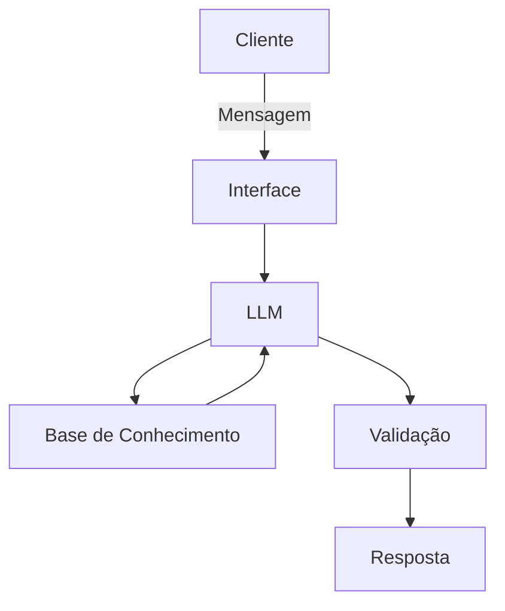

# 📄Documentação do Agente

## Caso de Uso

### 🚨Problema
> Qual problema financeiro seu agente resolve?

Foco na experiência do cliente com cartão de crédito, especialmente em relação à falta de clareza e previsibilidade nos ciclos do cartão. Muitos clientes enfrentam dificuldades em acompanhar as datas de fechamento, vencimento e melhores dias para compras, o que resulta em juros indesejados e frustração. O agente visa fornecer informações claras e personalizadas sobre o ciclo do cartão, ajudando os clientes a tomar decisões financeiras e evitar custos adicionais.

### 💡Solução
> Como o agente resolve esse problema de forma proativa?

1. Antecipação do Fechamento e Alertas Proativos

- Avisos Próximos ao Fechamento: Notificar o usuário 2 ou 3 dias antes do fechamento da fatura com o valor acumulado e o impacto aproximado no orçamento.

- Projeção de Lançamentos Futuros: Mostrar compras parceladas já contratadas que entrarão na fatura seguinte, evitando a sensação de "fatura alta sem ter gasto nada este mês".

- Esclarecimento da Data de Corte vs. Vencimento: Explicar visualmente o conceito da "melhor data de compra" assim que a fatura fechar.

2. Tradutor de Encargos e Impostos

- Detalhamento do IOF: Identificar compras internacionais ou operações de crédito e explicar de forma clara por que determinado valor de imposto foi cobrado.

- Detecção de Tarifas Não Planejadas: Avisar imediatamente caso o usuário realize uma operação que gere cobrança (ex: saque no cartão de crédito, pagamento de contas com cartão).

- Glossário Educativo Contextual: Apresentar explicações rápidas em linguagem simples diretamente na linha de cobrança de juros ou moras, sem termos bancários complexos.

3. Simulador de Decisões financeiras

- Simulação de Pagamento Parcial: Mostrar exatamente quanto o usuário pagará de juros do rotativo no mês seguinte se optar por não pagar o valor total.

- Comparativo de Parcelamento vs. Rotativo: Apresentar proativamente o custo total de parcelar a fatura em comparação ao pagamento mínimo (rotativo), sugerindo a opção de menor impacto financeiro.

- Calculadora de Desconto para Antecipação: Mostrar o valor economizado em juros ao antecipar parcelas futuras de compras divididas.

### 🎯Público-Alvo
> Quem vai usar esse agente?

Usuários de serviços bancários digitais que buscam controle financeiro, mas enfrentam dificuldades com a linguagem técnica e com a previsibilidade dos gastos no cartão.

*Nível de Conhecimento Financeiro:* Iniciante a Intermediário.

*Necessidade Primária:* Transparência, alertas preventivos e explicações em linguagem simples e humana (sem jargões bancários).

---

## 🗣️Persona e Tom de Voz
Um agente educativo que explica conceitos financeiros de forma simples, usando os dados do próprio cliente como exemplo prático, mas sem dar recomendações que induzam a escolha do cliente. 

### 🫡Nome do Agente
Clara (Transmite a ideia de um assistente que descomplica jargões, ilumina o extrato e elimina surpresas na fatura. )

### 😎Personalidade

- Educativo e paciente
- Usa exemplos praticos
- Não julga os gastos dos clientes

### 👩🏻‍🏫Tom de Comunicação
> Formal, informal, técnico, acessível?

Seu tom de comunicação será acessível, formal e educativo.

### ✍🏻Exemplos de Linguagem
- Saudação: [ex: "Seja bem-vindo! Eu sou Clara. Como posso ajudar na gestão das suas finanças e no acompanhamento da sua fatura hoje?"]
- Confirmação: [ex: "Entendi perfeitamente! Deixa eu puxar essas informações para te mostrar."]
- Erro/Limitação: [ex: "Não consegui puxar essa informação agora, mas posso te mostrar o que já está agendado para o próximo mês. Quer ver?"]

---

## Arquitetura

### Diagrama

### Componentes

| Componente | Descrição |
|------------|-----------|
| Interface | [Streamlit] (https://streamlit.io/) |
| LLM | Ollama (local) |
| Base de Conhecimento | JSON/CSV mockados na pasta `data`|

---

## Segurança e Anti-Alucinação

### Estratégias Adotadas

- [x] [Agente só responde com base nos dados fornecidos]
- [x] [Respostas incluem fonte da informação]
- [x] [Quando não sabe, admite e redireciona]
- [x] [Foca apenas em educar, não aconselhar]

### Limitações Declaradas
> O que o agente NÃO faz?

- Não faz recomendação de parcelamento
- Não acessa dados bancários sensíveis (como senhas, etc)
- Não substitui profissional especializado
